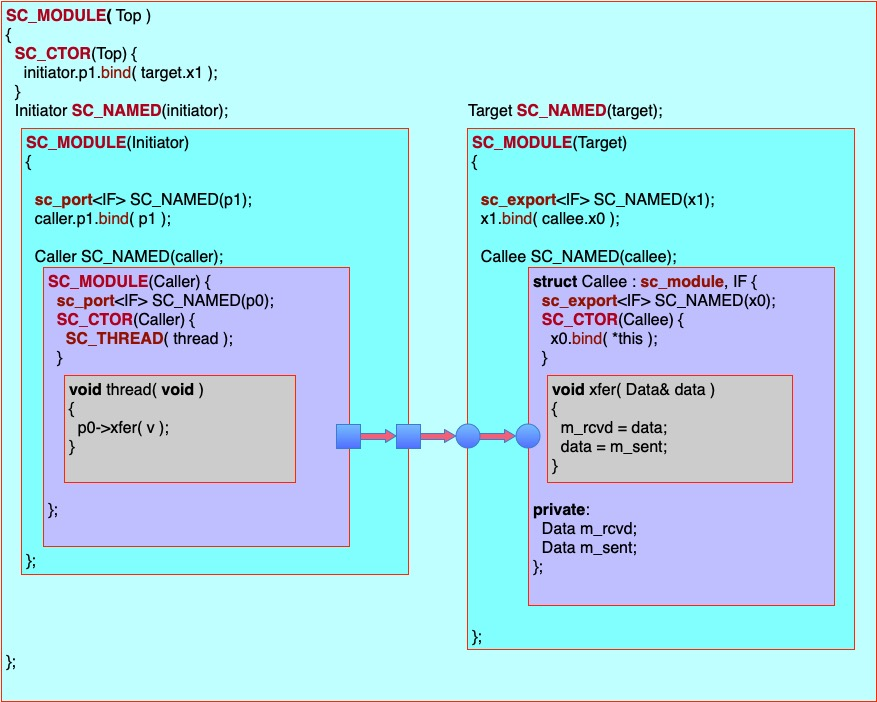

This project illustrates the principles of ports and exports in SystemC. The following picture should help in understanding the code:



## How to build

The build script is provided as a shortcut to using CMake.

```bash
source setup.profile
build systemc
build fmt
build -test
```

The above is a shortcut for:

```bash
HERE=`pwd`
# Build SystemC - download, configure, compile, link & install
mkdir -p ${HOME}/.local/src
cd ${HOME}/.local/src
git clone https://github.com/accellera-official/systemc.git systemc
cd systemc
git checkout main
rm -fr build-cmake-clang
cmake -B build-cmake-clang \
  -DCMAKE_INSTALL_PREFIX=/Users/dcblack/.local/apps/systemc\
  -DCMAKE_CXX_STANDARD=17\
  -DBUILD_SOURCE_DOCUMENTATION=off\
  -DCMAKE_BUILD_TYPE=RelWithDebInfo
cmake --build build-cmake-clang
cmake --install build-cmake-clang

# Build libfmt - download, configure, compile, link & install
cd ${HERE}
mkdir -p extern
cd extern
git clone https://github.com/fmtlib/fmt.git
cd fmt
cmake -B build -S . \
  -DCMAKE_INSTALL_PREFIX=${HERE}/portexport/extern
cmake --build build
cmake --install build

# Configure, compile, link and run the test
cd ${HERE}
cmake -B build/debug -DCMAKE_BUILD_TYPE=Debug
cmake --build build/debug
ctest --test-dir build/debug -C Debug -VV -LE long
```

## Files

```sh
├── .gitignore # files for git to ignore
├── CMakeLists.txt
├── README.md # this document
├── cmake/ # supports for cmake with SystemC
├── extern/
│   ├── bin/ # aids to compilation
│   ├── include/ # external headers (i.e., fmt) installed here
│   ├── lib/ # external libraries (i.e., libfmt.a) installed here
│   └── scripts/ # supports for bash scripts
├── portexport.cpp # the real source
├── portexport.jpg 
├── sc_format.hpp # SystemC formatters
└── setup.profile # sets up the environment
```

